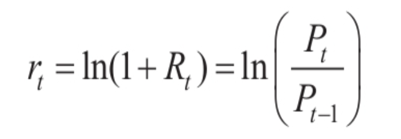

# income-free

实现财富自由吧！

## 金融基础概念
- 收益率
- 对数收益率
  - 当x比较小的时候（比如小于10%时），ln(x)和x的值是很接近的
  - 可以简化多阶段收益。k阶段总的对数收益就是k阶段的对数收益之和
  - 将对数收益绘制成图表，在直观上更接近真实的表现。（比如股票从1元涨到10元，相当于翻了10倍，再从10元涨到100元，也是翻了10倍）

  

- 年化收益：（最终价值/初始价值-1）/交易日数量×252
  > 也就是： (Pt-Pt-1)/days×252， 其中252表示每年有252个交易日，业界为了方便固定的值，实际每年都不一样
  > 
- 波动率
  > 波动率（Volatility）和风险，可以算是一对同义词，都是用来衡量收益率的不确定性的。波动率可以定义为收益率的标准差，即 σ=Std(r)